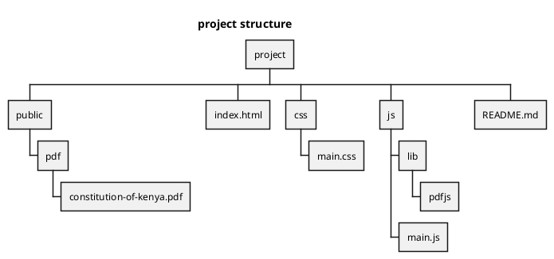

# Overview
This project is a PdfReader written in javascript. This is a website written in HTML, JS and CSS.

# Start Project
Install [PHP](https://www.php.net/).
Run a Php server

`php -S localhost:8000`

# Project Structure
This is the project structucte writen in plantuml.

js -> where javascript files and libraries are kept
css -> where stylesheets are kept
public -> where public rescources are available.

